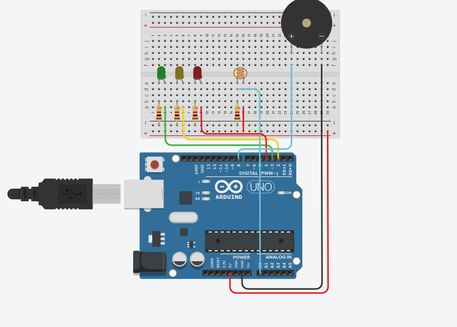

## PEDRO RIBEIRO E LUANA BRANDÃO

## Projeto de controle de luminosidade de uma estufa de planta ornamental

<p> Plantas ornamentais são espécies cultivadas com o principal objetivo de embelezar ambientes, sejam eles internos ou externos. Elas são apreciadas por suas cores, formas, texturas e perfumes, e incluem uma grande variedade de tipos, como flores, arbustos, árvores, trepadeiras e até mesmo suculentas e cactos.</p>

<p> Essas plantas desempenham um papel importante na decoração de jardins, praças, varandas, escritórios e residências, trazendo vida, frescor e sofisticação aos espaços. Além da estética, muitas também contribuem para a melhoria da qualidade do ar, promovem bem-estar e proporcionam um contato mais próximo com a natureza.</p> 
<p> No ano de 2009 a floricultura movimentou aproximadamente 750
milhões de reais e no ano seguinte esse valor foi próximo de 825 milhões de
reais (ICEPA, 2010). Esse crescimento é causado principalmente
pelo aumento da renda dos brasileiros, o acesso mais fácil as plantas e o
avanço das tecnologias usadas nessa atividade (IBRAFLOR, 2011).</p>


### Motivação do projeto: Controle de Luminosidade em uma Estufa para Plantas Ornamentais

<p> O cultivo de plantas ornamentais exige atenção cuidadosa a diversos fatores ambientais, sendo a luminosidade um dos mais determinantes para o crescimento saudável e o desenvolvimento estético dessas espécies. Cada planta possui necessidades específicas de luz, e o controle inadequado pode comprometer sua cor, forma e até sua sobrevivência. </p>
<p> Pensando nisso, este projeto visa desenvolver um sistema eficiente de controle de luminosidade em estufas, que permita criar um ambiente ideal para o cultivo de diferentes tipos de plantas ornamentais. Através da automação e monitoramento contínuo da intensidade luminosa, buscamos oferecer às plantas as condições ideais para que expressem todo o seu potencial ornamental. </p>
<p> O projeto prático teve se início usando o site Tinkercad, para desenvolvimento e progamação simulando ambientes reais, abaixo está listado os componentes usados no projeto.</p>

 **Componentes usados:**

* Arduino UNO
* Protoboard
* 3 resistores de 220Ω
* 1 resistor de 10kΩ
* 3 leds, sendo 1 verde, 1 amarelo e 1 vermelho
* 1 buzzer 
* 1 fotoresistor LDR 

``FOTO PROJETO``



**Código do projeto:**
```int valorLdr;
int v100 	= 679;
float v80 	= 543.2;
float v79 	= 536.41;
float v50	= 339.5;
int i; 		

void setup()
{
	Serial.begin(9600);
  	pinMode(4, OUTPUT);
  	pinMode(2, OUTPUT);
  	pinMode(3, OUTPUT);

  
}

void loop()
{
  valorLdr = analogRead(A0);
  
  if(valorLdr <= v100 && valorLdr >= v80){
  	digitalWrite(4,HIGH);
    digitalWrite(2,LOW);
    digitalWrite(3,LOW);
    
    	tone(8,1000, 200);
    	delay(300);
    	tone(8,1000, 200);
    	delay(300);
    	tone(8,1000, 200);
    	delay(1000);
    
  }else if(valorLdr <= v79 && valorLdr >= v50){
  		digitalWrite(4,LOW);
    	digitalWrite(2,HIGH);
    	digitalWrite(3,LOW);
    
        tone(8,1000, 200);
    	delay(300);
    	tone(8,1000, 200);
    	delay(1000);
    
  	}else if(valorLdr < v50){
  		digitalWrite(4,LOW);
    	digitalWrite(2,LOW);
    	digitalWrite(3,HIGH);

    	tone(8,1000, 200);
    	delay(1000);
  		}
  	 
  
  
  Serial.print("Valor do LDR:");
  Serial.println(valorLdr);
	delay(50);


}
```
**Artigos embasados como referência:** <br>
Produção e Comercialização de Plantas
Ornamentais na Empresa Fazenda do Jardim - Morgana Tuzzi (2011) <br>
Link:https://repositorio.ufsc.br/xmlui/bitstream/handle/123456789/25460/ragr245.pdf?sequence=1&isAllowed=y

Utilização do Ciclo PDCA para Desenvolvimento de uma Estufa Agrícola Automatizada - Vitor Abel Monteiro Alves (2019) <br>
Link:https://d1wqtxts1xzle7.cloudfront.net/63151155/2019_capitulo_Estufa20200430-92939-z0vhob-libre.pdf?1588275753=&response-content-disposition=inline%3B+filename%3DCapitulo_8_Utilizacao_do_ciclo_PDCA_para.pdf&Expires=1744243485&Signature=UXLrm5XuD-aP-h09jteV6Kh8gEYWkRMOmLozPufqfpt2NoOoC2AwntUG3pcGgJoJu-bh1ovVYs1lK3Wz5G6R~Gl5BkPQD9SECy~3mAVqQJ-y4JGIzOYvLHLvwYuuSizkqFf-kw2J-DxUXY4NiaqKs0PGF9UknKNTXeJi5jV9j5bWWXcyrqX~Fo4pC-rUsfOIr~ulRbjZLowmiOpiUytN~GfLlcwuXYqC7tj58M~1UjG5QzF9u0movZCDFUr-~UVSmfXXe~uYh-TylIbQVcokkCSO2W-lyYuXT-9rTyGk99957AMrDxUaD1q4S6v~AdhUzu8~uNZqcL--~x4f8Ih9Kw__&Key-Pair-Id=APKAJLOHF5GGSLRBV4ZA

Cadeia de produção, comercialização e logística de sementes, mudas e plantas ornamentais no Estado de São Paulo - Douglas Brand (2014) <br>
Link: https://lume.ufrgs.br/handle/10183/268100

 

